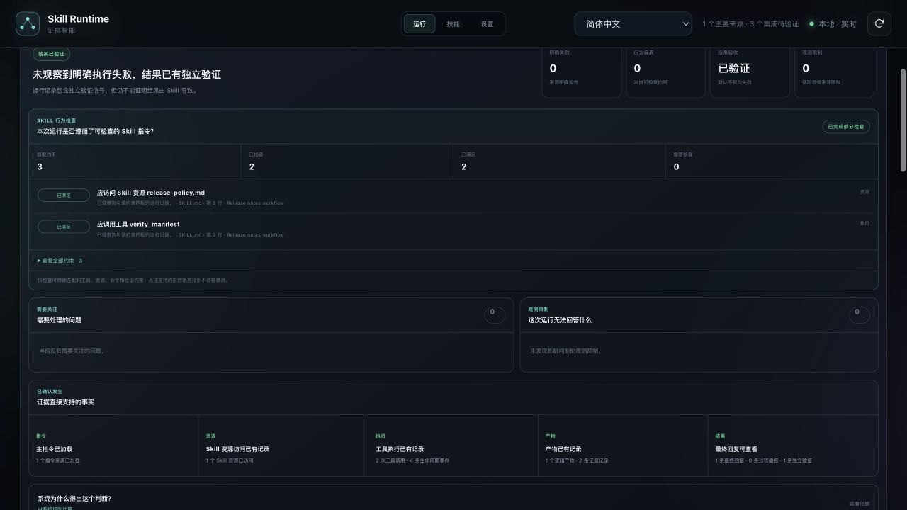
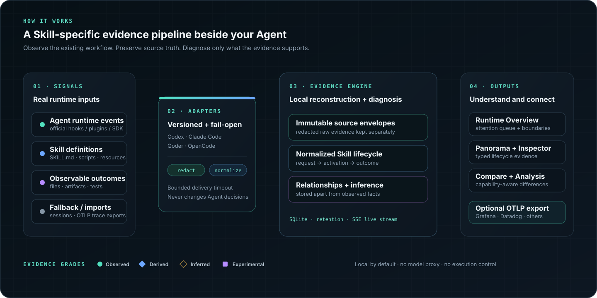

# Agent Skill Runtime Intelligence

<!-- locale-switcher:start -->
[English](README.md) · [简体中文](README.zh-CN.md) · [繁體中文](README.zh-TW.md) · [Français](README.fr.md) ·
[Deutsch](README.de.md) · [Italiano](README.it.md) · [Español](README.es.md) · [日本語](README.ja.md) ·
[한국어](README.ko.md) · [Русский](README.ru.md) · [Português (Brasil)](README.pt-BR.md) · [Türkçe](README.tr.md) ·
**Polski** · [Čeština](README.cs.md) · [Magyar](README.hu.md)
<!-- locale-switcher:end -->

[](https://github.com/hellogxp/skill-runtime-intelligence/actions/workflows/ci.yml)
[](https://github.com/hellogxp/skill-runtime-intelligence/releases/latest)
[](LICENSE)
[](https://www.python.org/)


> Zdiagnozuj, gdzie po raz pierwszy przebiegała umiejętność agenta, i sprawdź dowody
> za każdym wnioskiem.

Agent Skill Runtime Intelligence to system dowodowy i diagnostyczny w trybie tylko do odczytu dla Agent Skills. Łączy definicje umiejętności, oficjalne zdarzenia wykonawcze agenta, zaimportowane ślady, powrót sesji i obserwowalne wyniki obszaru roboczego w Skill Run Panorama oceniony jako dowód.



## Szybki start

Zainstaluj i uruchom najnowszą wersję na macOS lub Linux:

```bash
curl -LsSf https://raw.githubusercontent.com/hellogxp/skill-runtime-intelligence/main/scripts/install.sh | sh -s -- --start
```

Nie jest wymagany żaden klon, konto, `sudo` ani GitHub CLI. Instalator sprawdza sumę kontrolną wydania, wykrywa obsługiwanych agentów i umiejętności, wyjaśnia każdą ścieżkę, którą odczyta, pyta raz przed włączeniem haków przeznaczonych tylko do obserwacji i otwiera lokalny UI pod adresem [http://127.0.0.1:4317](http://127.0.0.1:4317). Dane wykonawcze pozostają w `~/.skill-runtime`, chyba że jawnie skonfigurujesz eksport.

Możesz [sprawdź instalatora](scripts/install.sh) przed uruchomieniem.

### Zobacz swój pierwszy koncert SkillRun

1. Zaakceptuj opcjonalną konfigurację awaryjnego otwarcia Hook, gdy instalator o to poprosi.
2. Uruchom ponownie Agenta i rozpocznij nowe zadanie. W Codex najpierw przejrzyj zarządzane polecenia w `/hooks`; istniejące zadania nie ładują nowych Hook na gorąco.
3. Użyj umiejętności normalnie, następnie potwierdź integrację i otwórz UI:

```bash
skill-runtime doctor
skill-runtime status
```

Integracja jest **na żywo** dopiero po odebraniu przez moduł zbierający prawdziwego zdarzenia wykonawczego. Skonfigurowany, ale niezaobserwowany Hook jest **Oczekujący** — nigdy nie prezentowany jako żywy dowód. Otwórz [http://127.0.0.1:4317](http://127.0.0.1:4317) lub zobacz [Przewodnik dla początkujących](docs/getting-started.md), aby uzyskać instrukcje dotyczące konkretnego agenta i sposoby rozwiązywania problemów.

Aby uruchomić bezpośrednio ze źródła realizacji transakcji:

```bash
python3 -m venv .venv
.venv/bin/python -m pip install -e .
.venv/bin/skill-runtime install --enable-hooks
.venv/bin/skill-runtime start
```

| Powierzchnia produktu | Co odpowiada |
|---|---|
| Runtime Overview | Które SkillRuns wymagają uwagi? |
| First Observable Boundary | Gdzie po raz pierwszy zaginęły dowody lub zostały one zawiedzione? |
| Skill Run Panorama | W jaki sposób prośba, aktywacja, zasoby, narzędzia, artefakty i wynik połączyły się? |
| Evidence Inspector | Jakie źródło, klasa, podstawa i możliwości adaptera potwierdzają to twierdzenie? |
| Porównywać | Czy różnica ma charakter behawioralny, czy tylko różnica w obserwowalności? |
| Inferred Analysis | Jakie wyjaśnienie oparte na dowodach lub jakie następne badanie jest wiarygodne? |
| Ustawienia / Lekarz | Co jest odczytywane, przechowywane, eksportowane, oczekujące i weryfikowane? |

## Jak to działa



Skill Runtime obserwuje przepływ pracy, z którego już korzystasz. Wersjonowane adaptery przekształcają zdarzenia natywne dla agentów w stabilny cykl życia umiejętności, podczas gdy surowe koperty źródłowe, znormalizowane zdarzenia, relacje i wnioski pozostają oddzielne. Silnik diagnostyczny najpierw identyfikuje najwcześniejszą granicę, w której brakuje dowodów lub je zawodzą; nie wymyśla intencji modelowej ani skuteczności przyczynowej.

| Źródło danych | Rola | Świeżość | Etykieta UI |
|---|---|---|---|
| Oficjalne haki / wtyczki / wydarzenia SDK agenta | Podstawowy cykl życia, narzędzie, podagent i dowód końcowy | Na żywo | `Official hook` / `Native telemetry` |
| Pliki umiejętności i obserwowalne wyniki w obszarze roboczym | Definicja, zasób, plik, artefakt i dowód testowy | Migawka na żywo / indeksowana | `Observed` |
| Transkrypcje sesji | Awaryjna kompatybilność, gdy Agent nie udostępnia wystarczającego czasu działania API | Prawie żywe lub historyczne | `Transcript fallback` |
| OTLP i obsługiwane eksporty śledzenia | Interoperacyjność i znaczenie historyczne | Eksport na żywo / import wsadowy | Pokazano profil źródłowy |
| Korelacja deterministyczna | Łączy zdarzenia z SkillRun bez zmiany faktów źródłowych | Przy spożyciu | `Derived` |
| Pomoc semantyczna | Tylko wyjaśnienia i sugestie dotyczące dochodzenia | Na żądanie | `Inferred` |

Obsługiwane adaptery innych firm są wersjonowane niezależnie:

| Agent | Integracja pierwotna | Powrót | Widoczność aktywacji |
|---|---|---|---|
| Codex | Oficjalna komenda Hooks | Import sesji | Wyraźna aktywacja po ujawnieniu przez zdarzenie Hook |
| Claude Code | Oficjalne Hooks | Import sesji | Wyraźne narzędzie umiejętności i dowód polecenia ukośnika, jeśli są ujawnione |
| Qoder | Oficjalna komenda Hooks | Lokalne rekordy | Wyraźna aktywacja po ujawnieniu przez narzędzie Umiejętności |
| OpenCode | Globalna wtyczka przeznaczona wyłącznie do obserwacji | Lokalne rekordy | Wywołania zwrotne narzędzi umiejętności, jeśli są ujawnione |

Dokładne granice możliwości są udokumentowane w [macierz możliwości adaptera](docs/adapter-capability-matrix.md). Nieobsługiwane i niezaobserwowane etapy pozostają widoczne, zamiast zamieniać się w awarie.

## Problem

Zainstalowanie umiejętności nie oznacza, że ​​agent ją odkrył. Odkrycie nie dowodzi aktywacji. Aktywacja nie oznacza, że ​​załadowano pełne instrukcje i zasoby. Wykonanie nie dowodzi, że Umiejętność poprawiła wynik.

Dziś te niepowodzenia często milczą. Deweloperzy pozostają z pytaniem:

- Czy Umiejętność była dostępna dla tego agenta?
- Czy zostało aktywowane dla tego żądania?
- Jakie instrukcje, odniesienia, skrypty i zasoby zostały załadowane?
- Jakie narzędzia, wywołania MCP, podagenci, pliki i artefakty były zaangażowane?
- W którym miejscu uruchomienie zakończyło się niepowodzeniem, ponowieniem próby lub utratą kontekstu?
- Czy umiejętność pomogła, czy tylko zwiększyła koszty i opóźnienia?

## Diagnoza specyficzna dla umiejętności

Podstawowym obiektem diagnostycznym jest `SkillRun`, a nie cała sesja Agenta:

```text
User request
    ↓
Skills discovered
    ↓
Skill selected / not selected
    ↓
SKILL.md activated
    ↓
References and scripts loaded
    ↓
Tools / MCP / subagents executed
    ↓
Files and artifacts produced
    ↓
Observable outcome
```

UI utrzymuje porządek cyklu życia, typowanie i ocenę dowodów. Brak danych telemetrycznych aktywacji oznacza „nie zaobserwowano” lub „nieobsługiwany”; nie oznacza to jednak, że Agent zdecydowanie pominął Umiejętność.

## Dyscyplina dowodowa

UI nigdy nie może przedstawiać wnioskowania jako faktu w czasie wykonywania:

- **Zaobserwowane** — wyraźnie obecne w zdarzeniu źródłowym lub pliku.
- **Pochodne** – deterministycznie powiązane z zaobserwowanymi dowodami.
- **Wywnioskowanie** — wiarygodne wyjaśnienie z niepewnością.
- **Eksperymentalny** – efekt mierzony poprzez kontrolowaną ocenę w parach.

Pojedynczy ślad może obsługiwać przypisanie wykonania. Nie może wykazać skuteczności przyczynowej. Twierdzenia takie jak „zwiększenie wskaźnika sukcesu dzięki tej umiejętności” wymagają ponownej oceny z umiejętnością/bez umiejętności.

## Zasady produktu

- Domyślnie prywatny, z wdrożeniem lokalnym, hybrydowym i połączonym z zespołem.
- Obserwacja tylko do odczytu; nigdy nie przejmuj pętli agenta.
- Brak modelowego serwera proxy i obowiązkowej usługi w chmurze.
- W produkcie domyślnym nie ma blokowania, bramki zatwierdzającej ani egzekwowania zasad.
- Wyraźne pochodzenie i klasyfikacja dowodów.
- Stopniowe ujawnianie informacji: najpierw prosta narracja, surowe wydarzenia na żądanie.
- Oparta na adapterach obsługa zmiany formatów transkrypcji agentów.

## Aktualny zakres

Środowisko wykonawcze obsługuje Codex, Claude Code, Qoder i OpenCode poprzez niezależne, wersjonowane adaptery i zapewnia:

- zainstalowany Odkrywanie i weryfikacja umiejętności;
- oficjalny zbiór Hook/wtyczek w czasie rzeczywistym oraz oznaczony powrót do sesji;
- Aktywacja umiejętności, ładowanie zasobów i harmonogramy wywoływania narzędzi;
- relacje podagenta, MCP, pliku i artefaktu;
- czas trwania, token, błąd, ponowna próba i podsumowania stanu, jeśli są dostępne;
- Runtime Overview i diagnoza pierwszej granicy;
- panoramiczny DAG, harmonogram wydarzeń i inspektor dowodów;
- porównanie tego samego agenta i wielu agentów uwzględniające możliwości;
- osobna powierzchnia Inferred Analysis, która nie może przepisać faktów wykonawczych;
- opcjonalny eksport OTLP/HTTP i obsługiwany import śledzenia obserwacji.

MVP **nie** obejmuje rynku, środowiska wykonawczego agenta uniwersalnego, egzekwowania zabezpieczeń, ładu korporacyjnego ani roszczeń o skutku przyczynowym.

## Szczegółowa instalacja

Aby uzyskać najkrótszą obsługiwaną ścieżkę, użyj jednowierszowego instalatora wersji w [Szybki start](#quick-start). Pełny przebieg pierwszego uruchomienia, specyficzne dla agenta kroki ponownego uruchomienia/zaufania, zachowanie prywatności i rozwiązywanie problemów są dostępne w [Przewodnik dla początkujących](docs/getting-started.md).

W przypadku programowania podstawowa implementacja nie ma żadnych zależności wykonawczych poza Python 3.9+. Z katalogu głównego repozytorium:

```bash
python3 -m venv .venv
.venv/bin/python -m pip install -e .
.venv/bin/skill-runtime install --enable-hooks
.venv/bin/skill-runtime start
```

Następnie otwórz [http://127.0.0.1:4317](http://127.0.0.1:4317).

Jednorazowa komenda `install`:

1. skanuje lokalizacje umiejętności użytkownika, projektu i wtyczki buforowanej;
2. wykrywa Codex, Claude Code, Qoder i OpenCode bez zmiany ich konfiguracji;
3. pokazuje, które ścieżki Agenta i Umiejętności zostaną odczytane;
4. pobiera natywnego nadawcę o niskim uruchomieniu, zweryfikowanego sumą kontrolną dla bieżącej platformy, powracając do lokalnej kompilacji C i na koniec nadawcy Python, i raz podczas instalacji wstępnie podgrzewa świeży natywny plik binarny;
5. tworzy `~/.skill-runtime/config.json` i lokalny indeks SQLite.

Kiedy jest uruchamiany interaktywnie, pyta raz przed dodaniem haków agenta typu Fail-Open. `--no-hooks` utrzymuje import transkrypcji jako opcję oznaczoną jako rezerwową, podczas gdy `--enable-hooks` rejestruje wyraźną zgodę i instaluje tylko wpisy zarządzane. W przypadku Codex otwórz `/hooks` po instalacji, przejrzyj dokładnie zarządzane polecenia i zaufaj im. Codex celowo wymaga tego wyraźnego przeglądu pod kątem haków dodanych poza konfiguracją zarządzanego przedsiębiorstwa. Rozpocznij nowe zadanie/sesję Codex po zaufaniu Hook, a następnie uruchom:

```bash
.venv/bin/skill-runtime doctor
```

Qoder ładuje konfigurację Hook przy uruchomieniu, więc zrestartuj Qoder po pierwszej instalacji. OpenCode odkrywa wtyczkę zarządzaną tylko do obserwacji w swoim globalnym katalogu wtyczek; zrestartuj OpenCode, jeśli bieżący proces poprzedza instalację. Żadna integracja nie odczytuje ani nie zmienia żądań modelu.

Integracja staje się **Live** dopiero po odebraniu przez bazę danych prawdziwego zdarzenia `official_hook`. Samo wpisanie `~/.codex/hooks.json` jest wyświetlane jako **Oczekujące**, nigdy nie połączone. `start` uruchamia moduł zbierający, moduł obserwatora rezerwowych transkrypcji, pracownika przechowującego, sklep SQLite i aktywny UI jako zarządzany proces w tle. Żadne żądanie modelu nie jest przesyłane przez serwer proxy.

Polecenia cyklu życia:

```bash
skill-runtime status
skill-runtime doctor
skill-runtime restart
skill-runtime stop
skill-runtime config --set retention_days=30
skill-runtime config --set network_export.endpoint=https://collector.example/v1/traces
skill-runtime config --set network_export.enabled=true
skill-runtime uninstall --keep-data
```

`uninstall` usuwa tylko zarządzane wpisy Hook i pliki będące własnością Skill Runtime. Bez `--keep-data` wymaga interaktywnego potwierdzenia (lub `--yes`) przed usunięciem `~/.skill-runtime`; Sesje agentów i źródła umiejętności nigdy nie są usuwane.

Aby indeksować i wyświetlać osobno:

```bash
PYTHONPATH=src python3 -m skill_runtime_intelligence index
PYTHONPATH=src python3 -m skill_runtime_intelligence serve
```

Zaimportuj istniejący eksport śledzenia z głównego systemu obserwowalności:

```bash
PYTHONPATH=src python3 -m skill_runtime_intelligence import \
  ./trace-export.json \
  --format auto
```

Wersjonowane profile importu rozpoznają obecnie kształty OTLP/Phoenix, Langfuse, LangSmith, W&B Weave i Datadog JSON. Tworzą SkillRun tylko wtedy, gdy źródło zawiera wyraźną semantykę Umiejętności; Ogólne nazwy zakresów nie są traktowane jako dowód aktywacji.

Eksportuj znormalizowane dowody środowiska wykonawczego specyficzne dla umiejętności do dowolnego punktu końcowego śledzenia OTLP/HTTP:

```bash
.venv/bin/skill-runtime start \
  --otlp-endpoint https://collector.example/v1/traces \
  --otlp-header Authorization='Bearer …'
```

Eksport jest wyłączony, chyba że punkt końcowy jest jawnie skonfigurowany. Punkty kontrolne, stan ponownych prób i stan miejsca docelowego są wyświetlane w Ustawieniach. Surowe podpowiedzi, ładunki narzędzi, dane uwierzytelniające i zawartość zasobów umiejętności nie są eksportowane. W przypadku uwierzytelnionego eksportu w tle podaj standard `OTEL_EXPORTER_OTLP_HEADERS` w środowisku przed `skill-runtime start`; nagłówki nigdy nie są zapisywane w argumentach konfiguracyjnych lub procesowych Skill Runtime.

## Wysyłaj dowody działania na żywo

`skill-runtime start` obejmuje lokalnego Kolekcjonera. Natywne adaptery telemetryczne, oficjalne zaczepy, lekkie zaczepy typu Fail-Open i integracje SDK mogą dołączyć pojedyncze zdarzenie lub ograniczoną partię do `POST /api/events`:

```bash
curl -X POST http://127.0.0.1:4317/api/events \
  -H 'Content-Type: application/json' \
  -d '{
    "event_id": "evt-example-activation",
    "event_type": "skill.activated",
    "occurred_at": "2026-07-29T05:00:00Z",
    "session_id": "agent-session-example",
    "turn_id": "turn-1",
    "activation_mode": "explicit_tool",
    "skill": {"name": "pdf"},
    "source": {
      "adapter": "example-agent",
      "adapter_version": "1.0",
      "collection_mode": "official_hook",
      "source_event_id": "source-event-1"
    },
    "evidence": {
      "grade": "observed",
      "confidence": 1.0,
      "basis": "Official runtime hook"
    },
    "payload": {"tool_name": "Skill"}
  }'
```

Punkt końcowy redaguje wspólne poświadczenia przed utrwaleniem, deduplikuje przez `event_id`, zachowuje osobną zredagowaną surową kopertę i zwraca wynikowy `skill_run_ids`. `GET /api/collector/schema` udostępnia obsługiwane słownictwo i tryby gromadzenia zdarzeń. UI nasłuchuje `/api/stream` przy użyciu SSE, z odpytywaniem tylko jako rezerwowym ponownym połączeniem.

Wskaźnik źródła odróżnia podstawowe dowody środowiska wykonawczego od `Transcript fallback` i importowanych śladów. Sam punkt końcowy modułu Collector nie żąda natywnej telemetrii: każdy producent musi zadeklarować, czy jego zdarzenie pochodzi z natywnej telemetrii, oficjalnego haka, lekkiego haka czy SDK.

### Opcjonalne haki agenta

Najpierw sprawdź dokładne ścieżki i zdarzenia. To polecenie jest tylko do odczytu:

```bash
.venv/bin/skill-runtime setup
```

Instalacja Hook wymaga wyraźnej flagi:

```bash
.venv/bin/skill-runtime setup --enable-codex-hooks
.venv/bin/skill-runtime setup --enable-claude-hooks
```

Instalator tworzy kopię zapasową konfiguracji Agenta, zachowuje istniejące zaczepy i dodaje tylko wpisy posiadające znacznik zarządzania Skill Runtime. Adapter haka przechowuje minimalne pola cyklu życia zamiast pełnych podpowiedzi lub ładunków narzędzi. W przypadku ukończonych wywołań narzędzi wyodrębnia tylko dokładne `SKILL.md`, standardowe zasoby umiejętności i ścieżki zmienionych plików w pamięci; surowe polecenia, treści poprawek, podpowiedzi i dane wyjściowe narzędzi są odrzucane przed utrwaleniem. Gdy środowisko wykonawcze jest aktywne, szybką ścieżką jest gniazdo Unix z ograniczonymi uprawnieniami; opcjonalny natywny nadawca pozwala uniknąć uruchamiania Python. Gdy środowisko wykonawcze nie jest aktywne, samodzielna ścieżka otwierania awaryjnego dołącza zredagowane dowody do `~/.skill-runtime/queue/events.jsonl`. `skill-runtime start` odtwarza tę kolejkę z deduplikacją identyfikatora zdarzenia.

Wydarzenia Codex używają swojego oficjalnego Hook API (`SessionStart`, `SessionEnd`, `UserPromptSubmit`, `PreToolUse`, `PostToolUse`, `PreCompact`, `PostCompact`, `SubagentStart`, `SubagentStop` i `Stop`). Codex obecnie wykonuje punkty poleceń synchronicznie, więc Skill Runtime używa lokalnego gniazda Unix/natywnego nadawcy z ograniczonym limitem czasu. Wszelkie niepowodzenia w dostawie są przełykane i umieszczane w kolejce; nigdy nie zmienia decyzji Agenta. Zobacz [oficjalna dokumentacja Codex Hook](https://developers.openai.com/codex/config-advanced#hooks).

Usuń tylko zarządzane wpisy za pomocą:

```bash
.venv/bin/skill-runtime setup --remove-codex-hooks
.venv/bin/skill-runtime setup --remove-claude-hooks
```

Serwer domyślnie łączy się z `127.0.0.1`. Komunikaty z pełną transkrypcją i ładunki narzędzi nie są kopiowane do indeksu. Wspólne tajne wzorce są redagowane przed utrwaleniem znormalizowanych podsumowań.

Uruchom wolny od zależności zestaw testów za pomocą:

```bash
PYTHONPATH=src python3 -m unittest discover -s tests -v
```

## Inżynieria wydania

GitHub Actions uruchamia testy Python 3.9–3.13, walidację JavaScript, kompilację natywnych nadawców i prawdziwy test dymu instalacji/startu/doktora/zatrzymania/odinstalowania. Znacznik `v*` tworzy pakiety koła/sdist oraz natywnych nadawców Linux i macOS chronionych sumą kontrolną. Instalator CLI pobiera pasujący zasób wersji, więc użytkownicy końcowi nie potrzebują kompilatora.

Uruchom pierwszy eksperyment diagnostyczny powiązany z produktem:

```bash
python3 experiments/runtime_diagnostics/run_benchmark.py
```

Wprowadza błędy w dowodach dotyczących cyklu życia, wyraźne awarie, niekompletne przebiegi i niezweryfikowane wyniki, a następnie ocenia ten sam deterministyczny silnik diagnostyczny, którego używają API i UI. Zobacz [Plan eksperymentu PAI-DSW](docs/pai-dsw-experiment-plan.md), aby zapoznać się z drabinką eksperymentów, testami braku zakłóceń i umową odtwarzalności.

Po zbudowaniu koła uruchom izolowany pakiet dymu cyklu życia za pomocą:

```bash
PYTHONPATH=src python3 experiments/product_lifecycle/run_benchmark.py
```

Instaluje się w tymczasowym środowisku wirtualnym i tymczasowym domu, wykonuje pełny lokalny cykl życia bez włączania przechwytów i weryfikuje brak zakłóceń w konfiguracji projektu i Agenta.

## Projektowanie produktu oparte na eksperymentach

Zachowanie produktu jest ograniczone przez [filozofia produktu oparta na eksperymentach](docs/experiment-driven-product-philosophy.md): dowody przed wnioskami, pierwszą obserwowalną granicę przed dotkliwością, relacje typowane przed płaskimi kłodami i rekonstrukcję deterministyczną przed pomocą probabilistyczną.

Aktualne, powtarzalne dowody lokalne obejmują:

- Minęło 7/7 lokalnych bram eksperymentalnych;
- 2400/2400 zdarzeń modułu zbierającego zaakceptowanych bez mutacji wejścia/wyjścia;
- 14/14 deterministyczne diagnozy korpusu usterek bez nieuzasadnionych twierdzeń przyczynowych;
- reprezentacja diagnozy relacyjnej z dokładnością 13/14 i F1 0,963, podczas gdy pobieranie płaskiego cyklu życia osiągnęło dokładność 1/14 i F1 0,080;
- W przypadku materiałów badawczych z 11/11 na pierwszym miejscu znajduje się najwcześniejsza obserwowalna granica.

Wyniki te potwierdzają mechanizmy i wybory dotyczące reprezentacji, a nie uogólnienie wdrożenia czy korzyści dla ludzi. Badania prawdziwego drugiego agenta, międzyplatformowe opóźnienia ogona, kalibracja rzeczywistych błędów i badania diagnozy uczestników pozostają otwartymi lukami w dowodach.

Kierunek badań opiera się również na sąsiadującej pracy podstawowej: [SkillsBench](https://arxiv.org/abs/2602.12670) i [SWE-Skills-Bench](https://arxiv.org/abs/2603.15401) motywują do diagnozy, ponieważ efekty Umiejętności są różne i mogą ulec regresowi; [Harness-Bench](https://arxiv.org/abs/2605.27922) motywuje do porównań między agentami uwzględniających możliwości; a [badanie pochodzenia wykonania](https://arxiv.org/abs/2606.04990) motywuje powiązania dowodów na maszynie, pochodzenie śladów i infrastrukturę audytu uwzględniającą prywatność.

## Dokumentacja

| Zacznij tutaj | Zamiar |
|---|---|
| [Getting Started](docs/getting-started.md) | Zainstaluj, podłącz agenta, zweryfikuj dowody na żywo i rozwiąż problemy |
| [Architektura](docs/architecture.md) | Potok gromadzenia, granice przechowywania, silnik dowodów i model zaufania |
| [Macierz możliwości adaptera](docs/adapter-capability-matrix.md) | Dokładne sygnały i ograniczenia według agenta/wersji |
| [Konfiguracja platformy obserwowalności](docs/observability-platform-setup.md) | Połącz platformy kompatybilne z OTLP i importuj obsługiwane ślady |
| [Model zdarzeń środowiska wykonawczego](docs/runtime-event-model.md) | Stabilne słownictwo dotyczące zdarzeń, pochodzenie, relacje i oceny dowodów |
| [Architektura informacji interfejsu użytkownika](docs/ui-information-architecture.md) | Przegląd, pierwsza granica, Panorama, Inspektor, Porównanie i Inferred Analysis |

Referencje dotyczące produktów i badań: [definicja produktu](docs/product-definition.md), [Specyfikacja MVP](docs/mvp-specification.md), [obserwowalność interoperacyjność](docs/observability-interoperability.md), [filozofia produktu oparta na eksperymentach](docs/experiment-driven-product-philosophy.md), [wyniki eksperymentu](docs/experiment-results-2026-07-29.md) i [program badawczy](docs/research-paper-agenda.md).

## Plan działania

1. **wersja 0.2.0 — Dostępne teraz:** kolekcja na żywo typu Fail-Open, cztery wersjonowane adaptery agentów, Runtime Overview, diagnostyka pierwszej granicy, Panorama, Evidence Inspector, porównanie uwzględniające możliwości, Inferred Analysis i interoperacyjność OTLP.
2. **Następnie — Wzmocnienie adapterów i diagnostyki:** szersze pokrycie agentów/wersji, kalibracja rzeczywistych błędów, weryfikacja opóźnień między platformami i badania diagnostyczne uczestników.
3. **Później — Ocena efektu:** kontrolowana ocena parowana z umiejętnością/bez umiejętności, wyraźnie oddzielona od diagnozy jednorazowej.

## Stan projektu

Wersja `v0.2.0` została opublikowana. Środowisko wykonawcze obejmuje inwentarz w rozdzielczości zainstalowanej, oficjalne adaptery Hook oparte na zgodzie dla Codex, Claude Code i Qoder, wtyczkę OpenCode służącą wyłącznie do obserwacji, etykietowaną rezerwę transkrypcji, przypisanie zakresu aktywnego, dokładne ścieżki plików/artefaktów, redakcję, oddzielne warstwy źródeł/relacji/wnioskowania, SQLite przechowywanie, przechowywanie, diagnostyka deterministyczna, UI na żywo i porównanie między różnymi agentami. Można importować eksporty OTLP/Phoenix, Langfuse, LangSmith, W&B Weave i Datadog; znormalizowane dowody można eksportować na żywo poprzez wyrażenie zgody OTLP/HTTP.

Odkrycie kandydata w modelu, powody selekcji wewnętrznej modelu, skuteczność semantyczna i twierdzenia o wyniku przyczynowym pozostają wyraźnie nie poparte, chyba że źródło lub kontrolowany eksperyment dostarczy takich dowodów.
